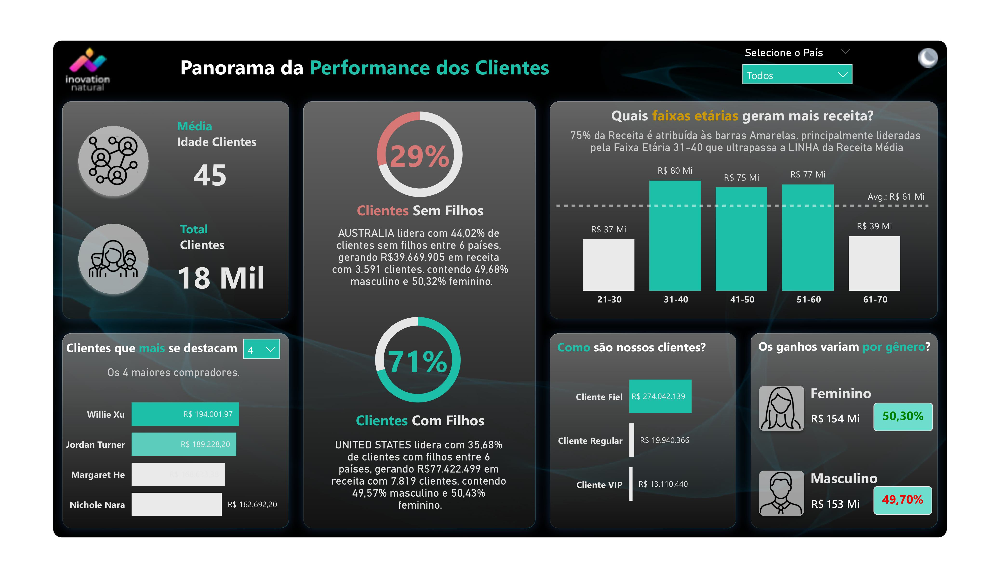

# Customer Performance Dashboard - Power BI 📊

Este projeto apresenta um dashboard interativo desenvolvido no Power BI, focado em avaliar o desempenho e os padrões de comportamento dos clientes de uma empresa de vendas online.

O relatório foi projetado com **modo claro e escuro** para melhorar a experiência do usuário, proporcionando conforto visual e acessibilidade.

---

## 🎯 Objetivos

- Analisar a performance dos clientes com base nos dados de vendas  
- Segmentar clientes em VIP, Fiéis e Regulares  
- Identificar clientes de maior valor  
- Entender tendências de receita por gênero e presença de filhos  
- Apresentar insights claros através de um design contextualizado  

---

## 🔍 Perguntas-chave respondidas

1. Qual a idade média dos clientes?  
2. Como classificar clientes em VIP, Fiéis e Regulares com base no número de pedidos e valor?  
   - Clientes VIP: num_total_pedidos ≥ 2 e valor > 100  
   - Clientes Fiéis: num_total_pedidos ≥ 2  
   - Clientes Regulares: num_total_pedidos < 2  
3. A presença de filhos influencia no comportamento de compra?  
4. Quem são os clientes de melhor desempenho?  
5. Existem diferenças significativas na receita por gênero?  
6. Como reduzir a carga cognitiva dos usuários com títulos e filtros contextuais?  

---

## 🗂️ Modelo de Dados

Tabelas principais utilizadas:  
- `DimCustomer`  
- `DimProduct`  
- `DimSalesTerritory`  
- `DimGeography`  
- `FactInternetSales`  

---

## 🎨 Design do Dashboard

- Modos claro e escuro para conforto visual  
- Visual limpo e organizado  
- Títulos em formato de perguntas para facilitar a compreensão  
- Navegação intuitiva focada no usuário final  

---

## 📸 Screenshots

### Light Mode  

### Dark Mode  

---

## 🚀 Como usar

1. Abra o arquivo `.pbix` no Power BI Desktop  
2. Explore os dados com filtros e segmentações  
3. Alterne entre modos claro e escuro para melhor experiência visual  

---

## 📚 Tecnologias e Conceitos Aplicados

- Modelagem de Dados (Star Schema)  
- DAX para Medidas e Colunas Calculadas  
- Segmentação de Clientes  
- Visualização Dinâmica com Títulos Contextuais  
- UX focado em acessibilidade e conforto visual  

---

## 💡 Insights

Este dashboard auxilia na identificação de segmentos que geram maior receita, na compreensão de tendências comportamentais e na personalização de estratégias comerciais com base em dados reais dos clientes.

---

## 🤝 Feedback

Feedbacks e sugestões são sempre bem-vindos!  

---

*Obrigado por visitar o repositório!* 🙌
